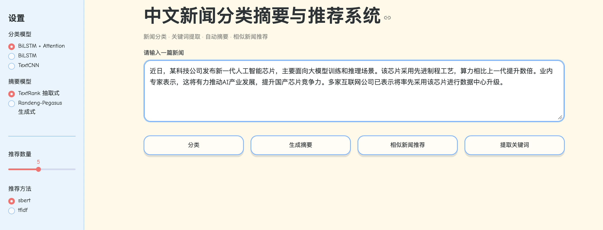
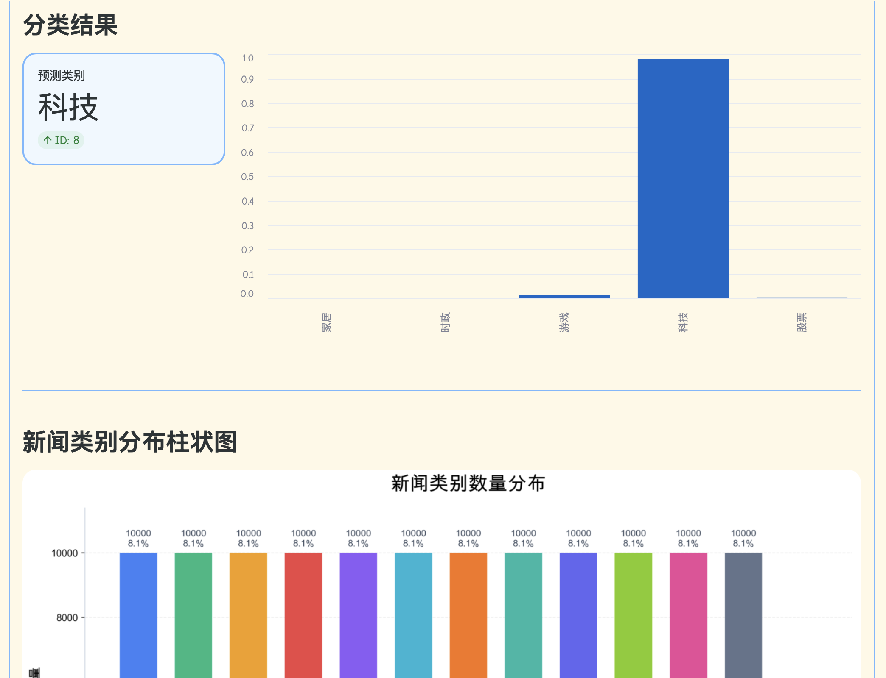
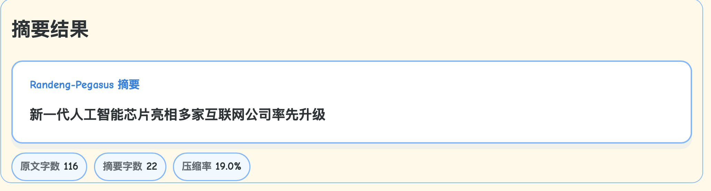
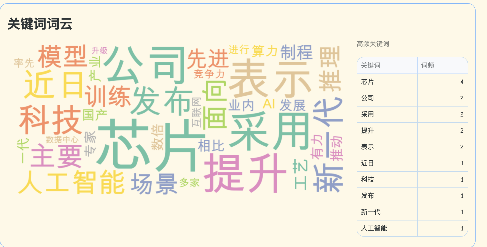
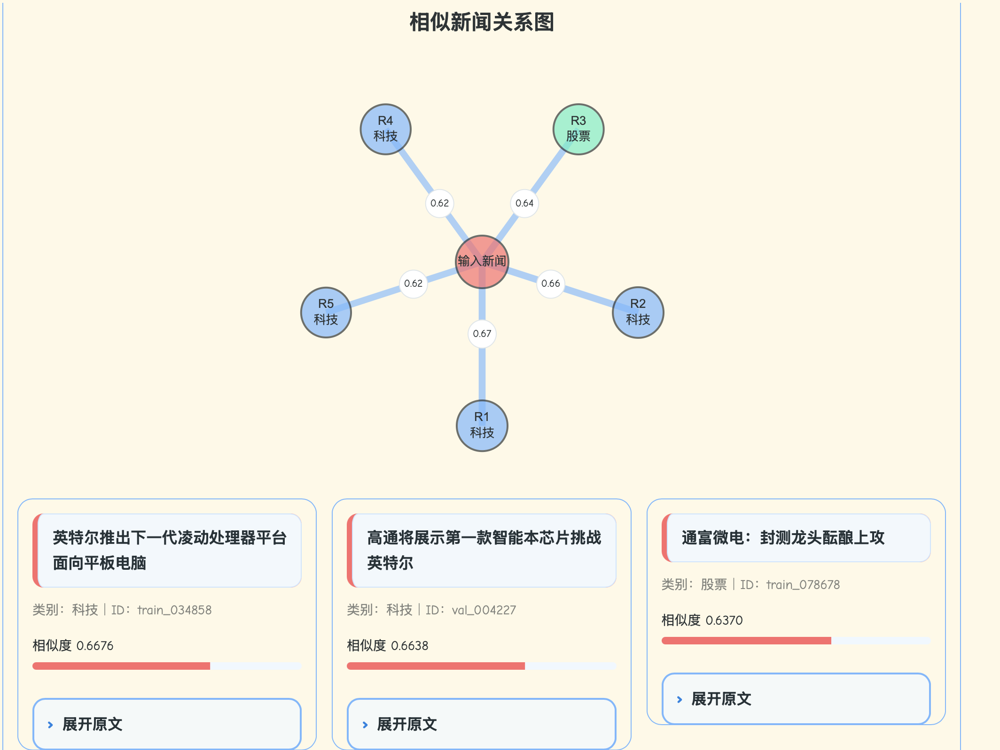

# nlp-2026
基于Transformer的中文新闻分类与摘要系统

## 1.数据集和分类模型权重获取

百度网盘链接：[点击下载](https://pan.baidu.com/s/1Cg_70zejFZH4ahf9EMgVjw?pwd=6k3p)  提取码：6k3p

里面有cnews_data.zip，包含train_csv, val_csv, test_csv， news_csv,解压后放到`data/processed/`

vocab.zip解压后放到`data/processed/`
fenlei_pt文件夹里有训练好的三种分类模型的.pt，放到`saved_models/`

saved_index.zip解压后放到对应文件夹

成员B的LCSTS 默认使用小规模子集，避免全量数据过大。项目中保留：
`data/LCSTS/train_small.csv`、`valid_small.csv`、`test_public_small.csv`。
如需重新生成小数据，请先把 LCSTS 原始 `jsonl` 文件放回 `data/LCSTS/raw/`，再运行 `python summarization/prepare_lcsts.py`。

## 2.快速运行

确认第1节中的数据、模型权重和推荐索引已经放入对应目录后，运行：

```bash
streamlit run app.py
```

浏览器打开：

```text
http://localhost:8501
```

Web 界面支持：

- 输入一篇中文新闻文本
- 选择分类模型
- 选择摘要模型：TextRank 抽取式或 Randeng-Pegasus 生成式
- 选择推荐方法：SBERT 或 TF-IDF
- 分别执行分类、摘要、关键词词云和相似新闻推荐


## 3.文件目录说明

```
nlp-2026-main-2/
├── app.py                         # Streamlit可视化交互界面
├── config.py                      # 全局路径、模型参数和文件配置
├── pipeline.py                    # 系统统一调用入口
├── README.md
│
├── classification/                # 分类
│   ├── textcnn.py
│   ├── bilstm.py
│   ├── bilstm_attention.py
│   ├── classifier_api.py           # 分类接口
│   └── predict_textcnn.py
│
├── train/                         # 分类模型训练脚本
│   ├── train_textcnn.py
│   ├── train_bilstm.py
│   └── train_bilstm_attention.py
│
├── summarization/                 # 自动摘要模块
│   ├── textrank_summary.py         # TextRank抽取式摘要
│   ├── randeng_pegasus_summary.py  # Randeng-Pegasus生成式摘要
│   ├── pegasus_summary.py          # Pegasus摘要统一封装
│   ├── pegasus_base_summary.py
│   ├── pegasus_finetuned_summary.py
│   ├── randeng_tokenizer.py        # Randeng-Pegasus tokenizer兼容实现
│   ├── model_utils.py
│   ├── summary_api.py              # 摘要接口
│   ├── prepare_lcsts.py
│   └── train_summary_model.py
│
├── keywords/                      # 关键词提取模块
│   ├── tfidf_keywords.py           # TF-IDF关键词提取
│   ├── textrank_keywords.py        # TextRank关键词提取
│   ├── keyword_api.py              # 关键词接口
│   └── prepare_csl.py
│
├── recommendation/                # 相似新闻推荐模块
│   ├── tfidf_recommender.py        # TF-IDF+余弦相似度推荐
│   ├── sbert_recommender.py        # Sentence-BERT语义向量推荐
│   ├── build_index.py              # 推荐索引构建脚本
│   └── recommend_api.py            # 推荐接口
│
├── visualization/                 # 可视化脚本与图表
│   ├── news_category_bar.png       # 新闻类别分布柱状图
│   ├── plot_news_category.py
│   ├── plot_category_distribution.py
│   ├── plot_similarity.py          # Top-K相似度可视化
│   └── plot_embedding.py           # SBERT向量PCA/t-SNE可视化
│
├── evaluate/                      # 评估
│   ├── eval_keywords.py
│   └── eval_summary.py
│
├── preprocess/                    # 数据预处理
│   ├── pre.py
│   ├── jieba_fenci.py
│   └── word2vec.py
│
├── common/                        
│   ├── __init__.py
│   └── text_utils.py
│
├── data/
│   ├── raw/                       
│   ├── processed/                 
│   └── LCSTS/                     
│
├── saved_models/                  # 分类模型权重
│   ├── textcnn.pt
│   ├── bilstm.pt
│   ├── bilstm_attention.pt
│   └── summary_model/             # 本地微调摘要模型目录，可选
│
├── saved_index/                   
│   ├── tfidf_vectorizer.pkl
│   ├── tfidf_matrix.pkl
│   ├── sbert_embeddings.npy
│   └── news_ids.json
│
├── results/                       # 实验结果与评估输出
│   ├── keyword_scores.csv
│   ├── keyword_examples.csv
│   ├── rouge_score.csv
│   ├── bertscore.csv
│   ├── summary_length.csv
│   ├── summary_examples.csv
│   ├── recommend_examples.csv
│   └── figures/
│       ├── category_distribution.png
│       ├── keyword_method_compare.png
│       ├── summary_compare.png
│       ├── similarity_topk.png
│       ├── embedding_visualization_pca.png
│       ├── embedding_visualization_tsne.png
│       └── embedding_by_category.png
│
├── static/                        # Streamlit主题字体资源
├── .streamlit/config.toml         # Streamlit页面主题配置
├── transfer/                     
└── vis/                          
```

## 4.项目功能

本项目面向中文新闻文本，集成新闻分类、关键词词云、自动摘要、相似新闻推荐和结果可视化功能。系统支持命令行接口和 Streamlit Web 界面两种使用方式。

| 功能 | 方法/模型 | 说明 |
| --- | --- | --- |
| 新闻分类 | TextCNN、BiLSTM、BiLSTM + Attention | 加载 `saved_models/` 中的已训练权重进行推理 |
| 关键词词云 | jieba 分词 + 词频统计，TF-IDF/TextRank 接口保留 | Web 界面展示当前新闻对应词云 |
| 抽取式摘要 | TextRank | 离线可用，适合作为快速摘要基线 |
| 生成式摘要 | Randeng-Pegasus-238M-Summary-Chinese | 首次运行需联网下载 HuggingFace 公开模型 |
| 相似新闻推荐 | TF-IDF、Sentence-BERT | 返回 Top-K 相似新闻，并展示相似新闻关系图 |
| 可视化展示 | Streamlit、Plotly、Matplotlib、WordCloud | 展示分类概率、类别分布图、词云、摘要统计和推荐关系图 |

## 5.环境安装

建议使用 Python 3.10 及以上版本

```bash
pip install streamlit pandas numpy jieba scikit-learn matplotlib seaborn plotly wordcloud
pip install torch transformers sentencepiece sentence-transformers huggingface_hub
```

如果使用 Conda，也可以先创建独立环境：

```bash
conda create -n news-nlp python=3.10
conda activate news-nlp
```

## 6.界面展示

#### 系统首页


#### 新闻分类结果



#### 摘要生成结果



### 关键词词云



#### 相似新闻推荐

